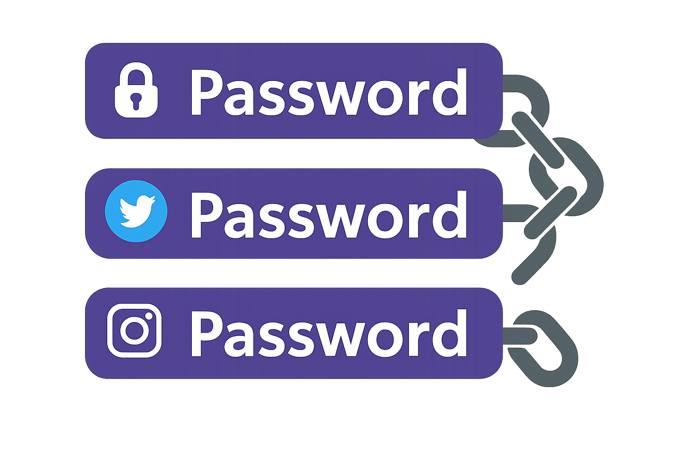
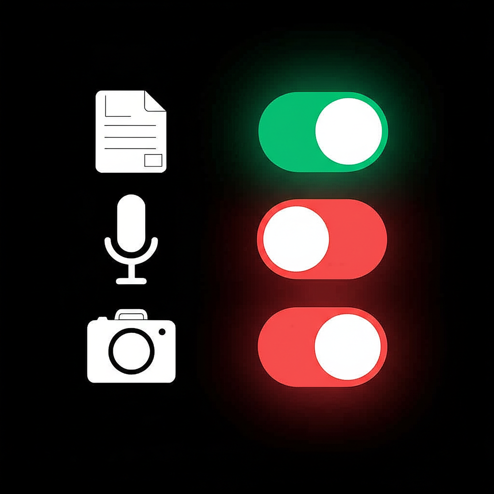
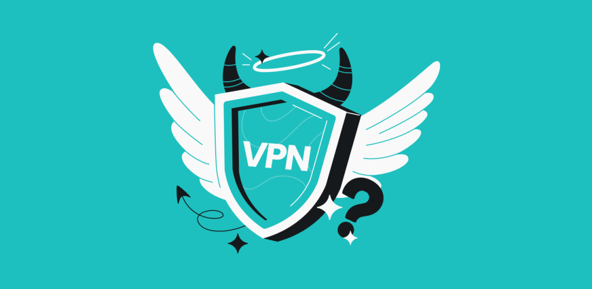
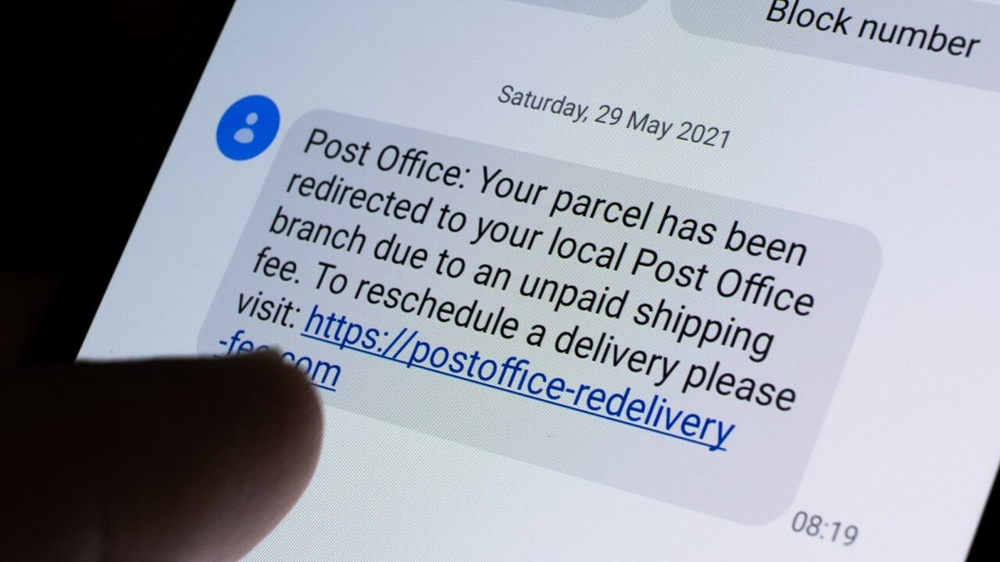
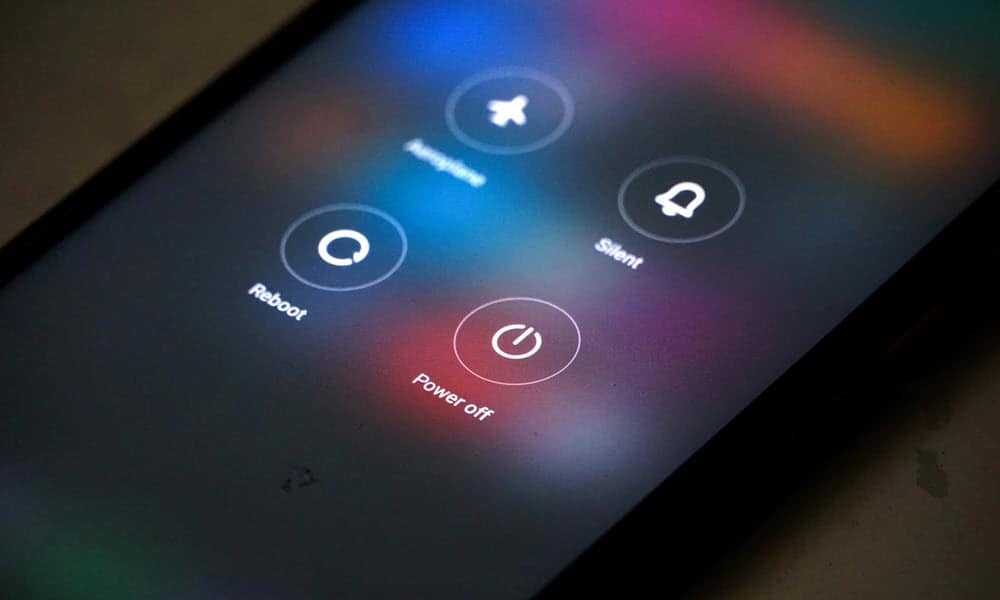
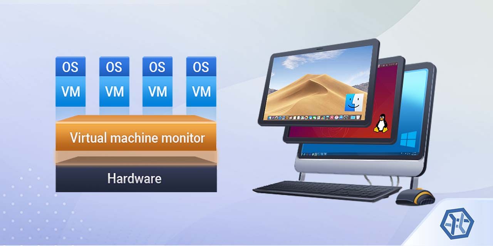
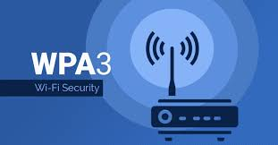

# Personal Security Methods for House Devices:
This repository is dedicated to providing comprehensive security methods and best practices for protecting personal devices commonly found in a household, including phones, PCs, smart TVs, WiFi routers, and more. As technology evolves, securing these devices against potential threats is crucial for safeguarding personal data and privacy. This guide offers practical, actionable steps to enhance device security and will be updated with additional devices and methods as new ones are integrated into the home environment. The goal is to empower users with the knowledge to maintain a secure digital ecosystem.

## Content
- [Phone Security Methods](#📱-phone-security-methods)
- [PC Security Methods](#💻-pc-security-methods)
- [Smart TV Security Methods](#📺-smart-tv-security-methods)
- [WiFi Router Security Methods](#🛜-wifi-router-security-methods)
- [General Security Habits](#📋-general-security-habits)

# 📱 Phone Security Methods
In today’s digital age, smartphones are central to our lives, storing sensitive data like personal messages, financial details, and private photos. However, this makes them prime targets for cyberattacks, data breaches, and privacy invasions. Securing your phone is critical to protect your personal information and maintain privacy. Here Are Some Methods To Protect Your Device.

## 1. Use Strong Passwords

- Weak passwords are the easiest entry point for hackers. A 6-character password can be cracked in seconds using brute-force attacks, while a 12+ character password with a mix of letters, numbers, and symbols takes significantly longer, often years, to break. Strong passwords are your first line of defense.

- Create passwords with at least 12 characters, combining uppercase, lowercase, numbers, and special characters.
- Avoid predictable patterns like "Password123" or personal info like birthdays.
- **Example**: Instead of “sunny12”, use “Ph0n3$3cur3!2025”. This combines randomness and complexity, making it harder to crack.

## 2. Use a Password Manager

Why It Matters :
 
Managing multiple strong, unique passwords without a password manager is nearly impossible. Reusing passwords or writing them down risks exposure. Password managers securely store and generate complex passwords, reducing the burden of memorization and enhancing security.

---

- Use trusted password managers like **Bitwarden** (cloud-based, open-source) or **KeePass** (local, offline storage).
- Set a strong master password for the manager itself.
- Enable two-factor authentication (2FA) for added security.
- **Example**: Bitwarden can generate a password like “X7$kP!m9Qw&2vL8” for your banking app and store it securely, so you only need to remember the master password.

## 3. Never Reuse Passwords
- Reusing passwords across accounts is a major vulnerability. If one account is compromised (e.g., through a data breach), hackers can use the same credentials to access other accounts, like your email or bank. Unique passwords limit the damage of a single breach.

- Use a password manager to generate and store unique passwords for every account.
- **Example**: If your Netflix password is “Stream!2025xZ”, your banking app should have a completely different password, like “B@nK$3cur3#9mP”.

## 4. Avoid Modded/Cracked Apps
- Modified or “modded” apps, often downloaded from unofficial sources, may contain malware that steals data, tracks activity, or compromises your device. Trusted app stores like Google Play or Apple’s App Store have strict vetting processes to minimize such risks.
- Only download apps from official stores.
- Check app reviews, developer reputation, and permissions before installing.
- **Example**: Instead of downloading a modded version of a game from a third-party site, get the official version from Google Play, even if it means paying a small fee.

## 5. Keep Your OS Updated
- Operating system updates patch security vulnerabilities that hackers exploit. Delaying updates leaves your phone exposed to known threats. For instance, unpatched Android or iOS devices can be vulnerable to exploits like Pegasus spyware.
- Enable auto-updates in your phone’s settings (e.g., Settings > Software Update > Auto-Update).
- **Example**: On an iPhone, go to Settings > General > Software Update and enable “Automatic Updates” to ensure iOS patches are applied promptly.

## 6. Limit App Permissions
- Apps often request unnecessary permissions, like camera access for a calculator app, which can be exploited to spy or steal data. Limiting permissions reduces the risk of apps accessing sensitive information without justification.

- Review permissions during app installation and revoke unnecessary ones.
- On Android, go to Settings > Apps > [App Name] > Permissions to manage access.
- **Example**: A game shouldn’t need access to your camera or contacts. Deny these permissions to prevent potential misuse.

## 7. Use a Strong Screen Lock

Why It Matters :
 
A weak screen lock, like a 4-digit PIN, can be easily guessed or bypassed. A strong password or biometric lock (fingerprint/face ID) protects your phone if it’s lost or stolen, preventing unauthorized access to sensitive data.

### How to Implement
- PIN: Use a long, random PIN (6-8 digits) that is not easily guessable.
- Password: A complex password with letters, numbers, and special characters is more secure than a PIN.
- Pattern: Avoid simple, easy-to-guess patterns. Choose a complex pattern that is difficult to guess

## 8. Limit Bluetooth and GPS
- Leaving Bluetooth or GPS enabled when not in use allows attackers to track your location or connect to your device via vulnerabilities like BlueBorne. Disabling them reduces your exposure to tracking and unauthorized access.
- Turn off Bluetooth and GPS in Settings or the quick settings menu when not needed.
- Only enable GPS for navigation apps and disable it afterward.
- **Example**: Disable Bluetooth after using wireless earbuds to prevent unauthorized pairing attempts.

## 9. Use a VPN
- Public Wi-Fi networks, like those in cafes or airports, are often insecure, allowing hackers to intercept your data. A Virtual Private Network (VPN) encrypts your internet traffic, protecting your browsing activity and sensitive information.

- Choose a reputable VPN provider like **ProtonVPN** or **NordVPN**.
- Enable the VPN when using public Wi-Fi or untrusted networks.
- **Example**: Activate ProtonVPN before browsing on a coffee shop’s Wi-Fi to encrypt your connection and prevent data snooping.

## 10. Secure Sensitive Storage
- Storing sensitive documents (e.g., IDs, financial records) in unsecured apps like your gallery risks exposure if your phone is compromised. Secure storage apps encrypt and password-protect your files, adding an extra layer of protection.
- Use apps like **Secure Folder** (Samsung) or Add App Lock On Gallery.
- Avoid storing sensitive files in cloud galleries without encryption.

## 11. Avoid Spam and Phishing
### Why It Matters
Phishing attacks via SMS, email, or malicious links trick users into revealing credentials or installing malware. Ignoring suspicious messages prevents you from falling victim to these scams.

- Don’t click links in unsolicited texts or emails.
- Verify the sender’s identity before responding.
- **Example**: If you receive an SMS claiming to be from your bank with a link to “verify your account,” call your bank directly to confirm instead of clicking.

## 12. Restart Your Phone Regularly
- Restarting your phone clears temporary files, closes background processes, and can disrupt persistent threats like malware or tracking scripts. Weekly reboots help maintain your device’s security and performance.

- Restart your phone every 7–10 days or after installing new apps.
- Use the power button or Settings > Restart option.
- **Example**: Schedule a weekly reboot every Sunday night to ensure your device starts fresh.

## Conclusion
Securing your phone requires proactive steps, but the effort is worth it to protect your personal data and privacy. By using strong passwords, limiting permissions, keeping your OS updated, and following the other recommendations in this guide, you can significantly reduce your risk of cyberattacks. Stay vigilant, and make security a habit.

# 💻 PC Security Methods
Your PC is the nerve center of your digital life, storing sensitive files, passwords, and personal data, making it a prime target for hackers, malware, and data breaches. Each step explains why it’s critical, how to implement it, and includes examples for clarity.

## 1. Forge a Strong Password
### Why It Matters
A weak PC password is like a flimsy lock on your castle gate—hackers can crack a 6-character password in seconds with brute-force tools. A 12+ character password with mixed characters is an ironclad barrier, resisting attacks for years.

---
- Create passwords with 12+ characters, mixing uppercase, lowercase, numbers, and symbols.
- Avoid predictable patterns like “password123” or personal info like birthdays.
- **Example**: Instead of “user123”, use “C0mp$3cur3!2025” for a robust, memorable login.

## 2. Keep Your System Updated
- Outdated systems are like castle walls with crumbling gaps—hackers exploit unpatched vulnerabilities (e.g., WannaCry ransomware). Regular updates seal these gaps, keeping your PC fortified against known threats.

- Enable auto-updates in Windows (Settings > Windows Update) or macOS (System Settings > Software Update).
- Check for updates weekly if auto-updates are disabled.
- **Example**: On Windows, go to Settings > Windows Update > Advanced Options and enable “Receive updates for other Microsoft products” to stay current.

## 3. Avoid Random USB Sticks
- Plugging in unknown USB sticks is like inviting a Trojan horse into your castle—malware like USB Rubber Ducky can execute malicious code instantly. Avoiding untrusted USBs prevents data theft or system compromise.

- Only use USB drives from trusted sources; scan them with antivirus before opening.
- Disable AutoRun in Windows (Control Panel > AutoPlay) to prevent automatic execution.
- **Example**: If you find a USB at a cafe, don’t plug it in—scan it with Malwarebytes first to ensure it’s clean.

## 4. Backup Important Data Safely
- Data loss from ransomware, hardware failure, or theft is like losing your castle’s treasury. Regular backups to secure locations ensure your files are safe and recoverable, no matter the threat.
- Use external hard drives or encrypted cloud services like **Backblaze** or **Google Drive**.
- Schedule automatic backups weekly and verify data integrity.
- **Example**: Use Windows Backup (Settings > Update & Security > Backup) to save files to an encrypted external drive weekly.

## 5. Enable Auto-Lock When Idle

Why It Matters :
 
An unlocked PC left unattended is like leaving your castle gate open—anyone can access your data. Auto-lock ensures your system secures itself after inactivity, thwarting unauthorized access.

---
- Set a short idle timeout (e.g., 5 minutes) in Windows (Settings > Accounts > Sign-in Options) or macOS (System Settings > Lock Screen).
- Require a password on wake from sleep or screensaver.
- **Example**: In Windows, set the screensaver to lock after 5 minutes via Settings > Personalization > Lock Screen > Screen Saver Settings.

## 6. Grant Minimum App Permissions
- Apps requesting excessive permissions (e.g., a game accessing your webcam) are like spies sneaking into your castle. Limiting permissions prevents apps from accessing sensitive data unnecessarily.
- Review permissions in Windows (Settings > Privacy) or macOS (System Settings > Privacy & Security).
- Revoke access to cameras, microphones, or files for non-essential apps.
- **Example**: Deny a text editor access to your PC’s microphone in Windows Privacy Settings to prevent eavesdropping.

## 7. Activate Microphone and Webcam Only When Needed
- Always-on microphones and webcams are like open windows—hackers can spy through them using malware (e.g., RATs). Disabling them when not in use blocks unauthorized surveillance.

- Disable mic and webcam in Windows (Settings > Privacy > Microphone/Camera) or macOS (System Settings > Privacy & Security).
- Use physical covers for webcams when possible.
- **Example**: Turn off your webcam in Windows Privacy Settings before browsing to prevent apps like Zoom from accessing it unnecessarily.

## 8. Use a Secure Password Manager (Local Preferred)

Managing unique passwords without a manager is like juggling knives—you’re bound to slip. A local password manager like **KeePass** keeps your credentials offline, safe from cloud breaches.

- Use **KeePass** (offline) or **Bitwarden** (cloud-based with 2FA) for password storage.
- Set a strong master password (15+ characters) and store the database on an encrypted drive.
- **Example**: Store “P@$$w0rd!2025xZ” for your email in KeePass, saved on a USB drive with VeraCrypt encryption.

## 9. Use a VPN for Secure Browsing
- Unsecured internet connections (e.g., public Wi-Fi) are like shouting your secrets in a crowded market—hackers can intercept data. A VPN encrypts your traffic, shielding your PC from snooping.
- Install a reputable VPN like **ProtonVPN** or **NordVPN**.
- Enable it on public or untrusted networks.
- **Example**: Activate ProtonVPN on your laptop at a coffee shop to encrypt your browsing and protect sensitive logins.

## 10. Install Secure Antivirus Software
- Malware, ransomware, and spyware are like digital plagues, stealing data or locking your PC. Trusted antivirus software acts as a vigilant guard, neutralizing threats before they strike.

- Install **Bitdefender**, **Malwarebytes**, or **Windows Defender** (free on Windows).
- Enable real-time protection and schedule regular scans.
- **Example**: Use Malwarebytes to scan your Downloads folder weekly, catching malicious files from recent downloads.

## 11. Shut Down Instead of Sleep When Away

Why It Matters :
 
A sleeping laptop is like a castle with guards napping—vulnerable to physical access or network attacks. Shutting down fully closes all processes, reducing risks when you’re away.

---
- Shut down via Start > Power > Shut Down when leaving with your laptop.
- Adjust power settings to prevent automatic sleep (Settings > System > Power & Sleep).
- **Example**: Before leaving your laptop at a hotel, shut it down completely to ensure no processes remain active.

## 12. Use Sandboxes or Virtual Machines for Suspicious Software
- Running untrusted software is like inviting a stranger into your castle—malware can wreak havoc. Sandboxes or virtual machines (VMs) isolate risky programs, containing potential threats.

- Use Windows Sandbox (Windows 10/11 Pro) or a VM like **VirtualBox**.
- Test suspicious files in an isolated environment before running them on your main system.
- **Example**: Open a questionable email attachment in Windows Sandbox to check for malware without risking your PC.

## 13. Disable Undesired Windows Features
- Unnecessary Windows features (e.g., remote desktop, unused services) are like extra castle gates—each is a potential entry point for hackers. Disabling them reduces your attack surface.
- Turn off features like Remote Desktop (Settings > System > Remote Desktop) and unused services (Control Panel > Administrative Tools > Services).
- Review installed features in Control Panel > Programs > Turn Windows features on or off.
- **Example**: Disable “Telnet Client” in Windows Features if unused to prevent potential exploitation.

## Conclusion
Securing your PC is like fortifying a castle—it takes effort but protects your digital treasures. By using strong passwords, keeping systems updated, and following these steps, you’ll shield your computer from cyber threats. Stay vigilant and make security a daily habit.

# 📺 Smart TV Security Methods
Your Smart TV is a window to entertainment, but it’s also a potential gateway for cyber-intruders seeking to spy, steal data, or disrupt your home network. Each step explains why it’s essential, how to implement it, and includes examples for clarity.

## 1. Enable Auto-Update for Software System

Why It Matters :
 
An outdated Smart TV is like a castle with unpatched walls—hackers can exploit known vulnerabilities to gain access or install malware. Automatic updates ensure your TV’s software is fortified with the latest security patches, keeping threats at bay.

---
- Navigate to your TV’s settings menu (e.g., Settings > System > Software Update) and enable auto-updates.
- Check for updates manually monthly if auto-updates are unavailable.
- **Example**: On a Samsung Smart TV, go to Settings > Support > Software Update and toggle “Auto Update” to keep your TV secure against exploits like those targeting outdated Tizen OS.

## 2. Disable Microphone When Not Needed
- An always-on microphone is like an open window in your castle—hackers can use malware to eavesdrop on your conversations. Disabling the mic when not in use prevents unauthorized surveillance and protects your privacy.

- Locate the microphone settings in your TV’s menu (e.g., Settings > Privacy > Voice Recognition) and disable it.
- Use a physical mute button or unplug external mics if available.
- **Example**: On an LG Smart TV, go to Settings > All Settings > General > AI Service > Voice Recognition and turn off the microphone unless using voice commands.

## 3. Monitor Suspicious Activity
- Unusual behavior, like apps opening automatically or unfamiliar devices on your network, is like a stranger wandering your castle grounds. Monitoring activity helps you detect potential hacks or malware early, preventing data theft or network breaches.
- Check your TV’s app usage or network connections in the settings menu.
- Use your router’s admin panel (e.g., 192.168.1.1) to monitor devices connected to your Wi-Fi.
- **Example**: If your TV suddenly streams unknown content, check Settings > Network > Connected Devices to identify unauthorized access, then reset the TV or change your Wi-Fi password.

## 4. Check TV Privacy Settings
- Default privacy settings on Smart TVs often allow excessive data collection, like viewing habits or voice data, which can be exploited by apps or advertisers. Adjusting these settings is like locking your castle’s secret passages, ensuring your data stays private.

- Review privacy options in your TV’s settings (e.g., Settings > Privacy or General > Privacy Policy).
- Disable data sharing, ad tracking, or automatic content recognition (ACR).
- **Example**: On a Roku TV, go to Settings > Privacy > Smart TV Experience and disable “Use Information from TV Inputs” to stop content tracking.

## 5. Only Download Apps from Trusted Sources
- Apps from unofficial sources are like unvetted guests in your castle—they may carry malware that spies or disrupts your TV. Trusted app stores (e.g., Samsung App Store, Google Play) vet apps, reducing the risk of malicious software.
- Download apps only from your TV’s official app store (e.g., LG Content Store, Roku Channel Store).
- Verify app reviews and developer credentials before installing.
- **Example**: Instead of sideloading a free streaming app from a third-party website, install Netflix from your TV’s official app store to ensure safety.

## Conclusion
Securing your Smart TV is like fortifying a magical portal—it protects your home network and personal data from cyber threats. By enabling auto-updates, disabling microphones, and following these steps, you’ll ensure your TV remains a safe hub for entertainment. Stay vigilant and make security a habit.

# 🛜 WiFi Router Security Methods
Your WiFi router is the gateway to your digital kingdom, connecting phones, PCs, and smart devices, but it’s also a prime target for hackers aiming to infiltrate your network. Each step explains why it’s critical, how to implement it, and includes examples for clarity.

## 1. Use WPA3 Encryption
- Using outdated encryption like WEP or WPA2 is like locking your castle with a rusty chain—hackers can break in easily. WPA3 is the latest, strongest WiFi encryption standard, protecting your network from brute-force attacks and eavesdropping.

- Access your router’s admin panel (e.g., 192.168.1.1) via a browser.
- Navigate to Wireless > Security Settings and select WPA3-Personal (or WPA2/WPA3 mixed mode if WPA3 isn’t fully supported).
- **Example**: On a TP-Link router, log in to the admin panel, go to Wireless > Wireless Security, and choose WPA3-Personal to encrypt your WiFi with a strong key like “N3tw0rk$3cur3!2025”.

## 2. Change the Default Router Login Credentials

Why It Matters :
 
Default router credentials (e.g., admin/admin) are like leaving your castle keys under the doormat—hackers know them and can seize control. A unique, strong password locks out unauthorized access to your router’s settings.

---
- Log in to your router’s admin panel and navigate to System > Administration or Password.
- Set a new username (if supported) and a strong password (12+ characters, mixed characters).
- **Example**: Change your Netgear router’s default “admin/password” to “R0ut3rM@st3r!2025” in the admin panel under Advanced > Administration > Set Password.

## 3. Use Strong Passwords

- Weak passwords are the easiest entry point for hackers. A 6-character password can be cracked in seconds using brute-force attacks, while a 12+ character password with a mix of letters, numbers, and symbols takes significantly longer, often years, to break. Strong passwords are your first line of defense.

- Create passwords with at least 12 characters, combining uppercase, lowercase, numbers, and special characters.
- Avoid predictable patterns like "Password123" or personal info like birthdays.
- **Example**: Instead of “sunny12”, use “Ph0n3$3cur3!2025”. This combines randomness and complexity, making it harder to crack.

## 4. Update the Router Firmware
- Outdated firmware is like an unpatched castle wall—hackers exploit known vulnerabilities to gain access or install malware. Regular firmware updates strengthen your router against the latest threats.
- Check for firmware updates in your router’s admin panel (e.g., System > Firmware Upgrade).
- Enable auto-updates if available, or manually update every 3 months.
- **Example**: On an ASUS router, go to Administration > Firmware Upgrade, check for updates, and install the latest version to patch vulnerabilities like those in older firmware.

## 5. Disable WPS (WiFi Protected Setup)
- WPS is like a hidden backdoor to your castle—it allows easy connections but is vulnerable to brute-force attacks that can crack your WiFi password in hours. Disabling WPS seals this weak entry point.
- Access your router’s admin panel and navigate to Wireless > WPS settings.
- Turn off WPS to prevent unauthorized devices from connecting.
- **Example**: On a Linksys router, log in, go to Wireless > Wi-Fi Protected Setup, and toggle WPS to “Disabled” to block PIN-based attacks.

## 6. Use a Guest Network
- Allowing guests or IoT devices on your main WiFi is like letting strangers roam your castle’s core—they could access sensitive devices. A guest network isolates untrusted devices, protecting your primary network.

- Enable the guest network in your router’s admin panel (e.g., Wireless > Guest Network).
- Set a unique, strong password for the guest network and limit its access to the internet only.
- **Example**: On a D-Link router, enable Guest Network under Wireless Settings, set a password like “Gu3st$3cur3!2025”, and restrict access to your main devices.

## 7. Enable the Router’s Firewall
- A disabled firewall is like a castle without guards—hackers can send malicious traffic to your network. An active firewall filters incoming and outgoing connections, blocking unauthorized access.

- Access your router’s admin panel and locate Security > Firewall settings.
- Enable the firewall and configure rules to block suspicious traffic (e.g., deny unknown IP addresses).
- **Example**: On a TP-Link router, go to Security > Basic Security, enable the SPI Firewall, and block DoS attacks to enhance network protection.

## 8. Regularly Monitor Your Network
- Unmonitored networks are like unguarded castle gates—intruders can sneak in undetected. Regular monitoring spots unfamiliar devices or suspicious activity, allowing you to act before a breach escalates.
- Check connected devices in your router’s admin panel (e.g., Network > Device List).
- Use network monitoring apps like **Fing** or **GlassWire** for real-time alerts.
- **Example**: Log in to your router at 192.168.1.1, check the Device List, and block an unknown device with a suspicious MAC address to secure your network.

## Conclusion
Securing your WiFi router is like fortifying the main gate of your digital castle—it protects every device on your network. By using WPA3, updating firmware, and following these steps, you’ll shield your home from cyber threats. Stay vigilant and keep security first.

# 📋 General Security Habits
- **Don’t Log In on Others’ Devices**: If you do, log out and clear data.
- **Use Alt Accounts**: Avoid personal accounts on untrusted websites; use alternates.
- **Protect Credentials**: Don’t enter passwords in public; watch for onlookers.
- **Don’t Share Passwords**: Keep them private.
- **Secure Password Storage**: If written, store in a locked safe, not on paper.
- **No Reused Passwords**: Use unique passwords for all accounts.
- **Stay Aware**: Learn about phishing, trojans, and other cyber threats.

## Incident Response
If a device acts strangely (e.g., slow, unknown apps), disconnect it from Wi-Fi, run antivirus (if applicable), reset to factory settings, and change all passwords. Contact support if needed.
